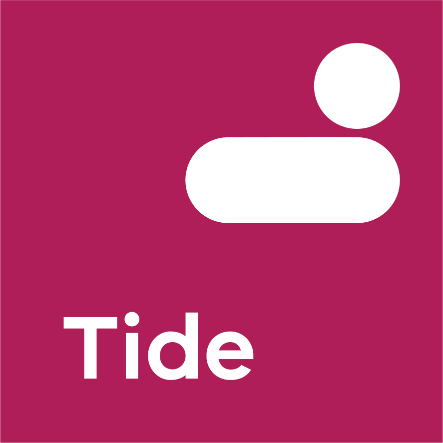

<p align="center"><a href="https://www.drupal.org/project/tide" target="_blank"></a></p>
<p align="center"><i>Tide is a Drupal 8 distribution focused on delivering an API first, headless Drupal content administration site.</i></p>

<p align="center">
<a href="https://circleci.com/gh/dpc-sdp/tide"></a>
<a href="https://github.com/dpc-sdp/tide/releases/latest"></a>
<a href="https://www.drupal.org/8"></a>
<a href="https://github.com/dpc-sdp/tide/blob/master/LICENSE.txt"></a>
<a href="https://github.com/dpc-sdp/tide/pulls"></a>
</p>

<!-- TABLE OF CONTENTS -->
# Table of Contents
* [About the project](#About-the-project)
  * [What is in this package](#what-is-in-this-package)
* [Use](#use) 
* [Contributing](#contributing)
  * [Development and maintenance](#development-and-maintenance)
* [Use](#use)
* [Support](#support)
* [Related projects](#related-projects)
* [License](#license)
* [Attribution](#attribution)

# About the project
[Tide](https://github.com/dpc-sdp/tide) distribution for building websites on the Single Digital Presence platform

Tide is a Drupal 8 distribution focused on delivering an API first, headless Drupal content administration site.

This package is merely a collection of all Tide modules that make up this distribution.

## What is in this package
- references to all Tide modules

# Use
To install this package, add this custom repository to `repositories` section of
your `composer.json`:

```json
{
  "repositories": {        
      "dpc-sdp/tide": {
          "type": "vcs",
          "no-api": true,
          "url": "https://github.com/dpc-sdp/tide_page.git"
      }
  }
}
```

Require this package as any other Composer package:
```bash
composer require drupal/tide 
``` 

# Contributing
[Open an issue](https://github.com/dpc-sdp) on GitHub or submit a pull request with suggested changes.

# Support
[Digital Engagement, Department of Premier and Cabinet, Victoria, Australia](https://github.com/dpc-sdp) 
is a maintainer of this package.

# Development and maintenance
Development is powered by [Dev-Tools](https://github.com/dpc-sdp/dev-tools). Please refer to Dev-Tools' 
page for [system requirements](https://github.com/dpc-sdp/dev-tools/#prerequisites) and other details.

To start local development stack:
1. Checkout this project 
2. Run `./dev-tools.sh`
3. Run `ahoy build`
 
# Related projects
- [tide_api](https://github.com/dpc-sdp/tide_api)         
- [tide_core](https://github.com/dpc-sdp/tide_core)
- [tide_event](https://github.com/dpc-sdp/tide_event)
- [tide_landing_page](https://github.com/dpc-sdp/tide_landing_page)
- [tide_media](https://github.com/dpc-sdp/tide_media)     
- [tide_monsido](https://github.com/dpc-sdp/tide_monsido) 
- [tide_news](https://github.com/dpc-sdp/tide_news)       
- [tide_page](https://github.com/dpc-sdp/tide_page)       
- [tide_search](https://github.com/dpc-sdp/tide_search)   
- [tide_site](https://github.com/dpc-sdp/tide_site)       
- [tide_test](https://github.com/dpc-sdp/tide_test)       
- [tide_webform](https://github.com/dpc-sdp/tide_webform)  

# License
This project is licensed under [GPL2](https://github.com/dpc-sdp/tide/blob/master/LICENSE.txt)

# Attribution
Single Digital Presence offers government agencies an open and flexible toolkit to build websites quickly and cost-effectively.
<p align="center"><a href="https://www.vic.gov.au/what-single-digital-presence-offers" target="_blank"></a></p>

The Department of Premier and Cabinet partnered with Salsa Digital to deliver Single Digital Presence. As long-term supporters of open government approaches, they were integral to the establishment of SDP as an open source platform.
<p align="center"><a href="https://salsadigital.com.au/" target="_blank"></a></p>
